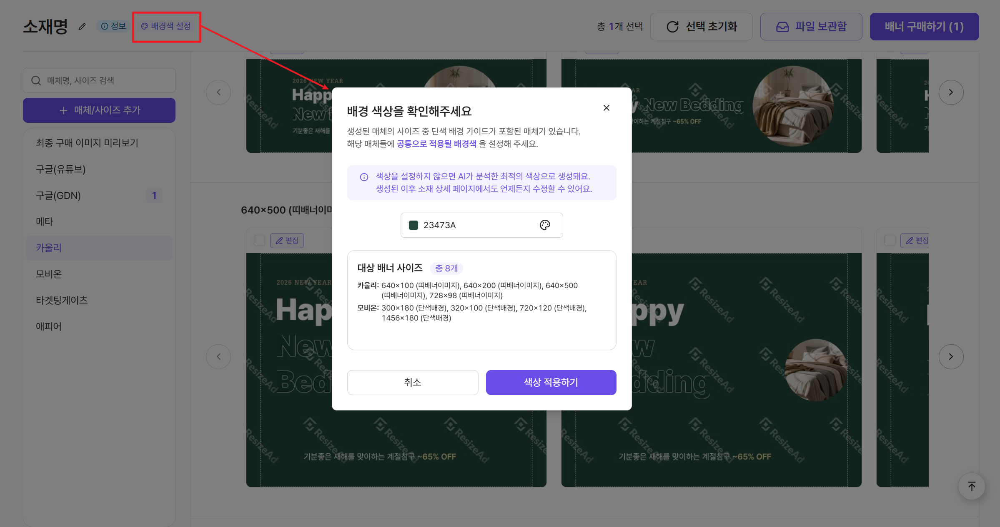

# 배너 편집하기

AI가 만든 배너가 마음에 쏙 들지만, 조금 더 내 취향대로 다듬고 싶으신가요?\
편집기로 오브젝트 크기/위치 이동, 배경 컬러까지 자유롭게 수정하고 완벽한 결과물을 만들어 보세요!

[#id-1](edit.md#id-1 "mention")

[#id-2](edit.md#id-2 "mention")

[#id-3](edit.md#id-3 "mention")

* [#undefined-3](edit.md#undefined-3 "mention")

[#id-4](edit.md#id-4 "mention")

[#undefined-4](edit.md#undefined-4 "mention")

***

### 1️⃣ 편집 화면 살펴보기

먼저 편집 화면의 주요 영역을 확인해 보세요. 익숙한 에디터로 금방 적응할 수 있을 거예요.

<figure><figcaption></figcaption></figure>

<table><thead><tr><th width="206">영역</th><th>설명</th></tr></thead><tbody><tr><td><strong>좌측 (원본/가이드)</strong></td><td>원본 아트보드 이미지와 매체 제작 가이드를 확인할 수 있습니다.</td></tr><tr><td><strong>중앙 (캔버스)</strong></td><td>선택한 배너를 직접 수정하는 작업 공간입니다.</td></tr><tr><td><strong>우측 (레이어/속성)</strong></td><td>각 요소를 레이어별로 확인하고, 위치나 크기를 정밀하게 조절할 수 있습니다.</td></tr></tbody></table>

***

### 2️⃣ 원하는 요소 선택하고 수정하기

캔버스에서 수정하고 싶은 오브젝트나 텍스트를 클릭해 보세요. **보라색 테두리**가 생기면 선택된 것입니다.

#### 📍 레이어 선택 및 관리

* 우측 `[레이어]` 패널에서 원하는 레이어를 직접 선택하거나 캔버스에서 직접 클릭 후 속성을 수정할 수있어요.
* &#x20;`눈 아이콘`으로 레이어를 숨기거나 `새로고침`으로 초기화 할 수 있습니다.

#### 📍 속성 정밀 조절

* **위치(X, Y):** 우측 `[속성]` 패널에서 X, Y 좌표값을 직접 입력하여 요소를 정확한 위치로 옮겨요.
* **크기(W, H):** 가로(W), 세로(H) 값을 입력하거나, 캔버스에서 직접 드래그하여 크기를 조절할 수 있어요.



<figure><figcaption></figcaption></figure>



<figure><figcaption></figcaption></figure>



***

### 3️⃣ 편집 중 유용한 기능

<table><thead><tr><th width="234">기능</th><th>설명</th></tr></thead><tbody><tr><td><strong>↩️ 되돌리기 / ↪️ 다시 실행</strong></td><td>상단 아이콘을 눌러 작업 내용을 취소하거나 되돌릴 수 있습니다.</td></tr><tr><td><strong>편집 초기화</strong></td><td>현재 작업 중인 내용을 처음 상태로 되돌립니다.</td></tr><tr><td><strong>원본으로 복구</strong></td><td>AI가 만든 원본 배너 상태로 돌아갑니다.</td></tr><tr><td><strong>매체 제작 가이드</strong></td><td>좌측 패널에서 해당 매체의 상세 가이드라인을 언제든 참고할 수 있습니다.</td></tr><tr><td><strong>단축키 도움말</strong></td><td>좌측 하단 클릭 시 편집 효율을 높여줄 단축키 목록을 확인할 수 있습니다.</td></tr></tbody></table>

***

#### 📍 시각적 보조 도구 활용하기 (캔버스 하단)

캔버스 하단에 있는 아이콘들을 활용해 편집 효율을 높여보세요.

* **그리드 보기** ▦ : 요소를 정렬하거나 간격을 맞출 때 유용합니다.
* **캔버스 외부 영역 보기** 👁️ : 캔버스 밖에 숨겨진 요소가 있는지 확인하거나, 전체 배경을 검토할 때 사용합니다.
* **편집 보조선 안내** ❓ : AI 편집 시 도움이 되는 가이드 선을 보여줍니다.
  * **빨간색 점선 (스냅 가이드)**: 요소를 이동할 때 캔버스 중앙이나 다른 레이어와 정렬을 돕는 기준선입니다.
  * **회색 점선 (여백 가이드)**: 매체에서 로고나 주요 텍스트가 잘리지 않도록 권장하는 최소 여백입니다. (매체 가이드가 있는 경우에만 노출됩니다.)

<figure><figcaption></figcaption></figure>


편집 화면의 가이드 체크 결과는 실시간으로 반영되지 않습니다. 최종 구매 전 꼭 배너 시안 화면에서 다시 확인해 주세요!


***

### 🖼️ 배경 설정하기

배경 관련 가이드가 있는 사이즈의 경우, 색상을 직접 설정할 수 있는 기능을 제공합니다.

> 💡AI가 매체 가이드를 분석하여 **최적의 평균값으로 배경 가이드를 자동으로 설정**해요.\
> 기본 설정이 마음에 드신다면 별도로 수정하실 필요가 없으며, 원하는 대로 변경하고 싶을 때만 아래 방법을 이용해 보세요.

#### **1. 개별 배너 배경색 설정 (편집 화면)**

선택한 개별 배너의 배경색을 섬세하게 조절할 수 있습니다.

<figure><figcaption></figcaption></figure>

1. 우측 `[레이어]` 패널에서 **배경 이미지 레이어**를 선택하세요.
2. `[속성]` 패널 하단의 **\[배경 색상]** 컬러칩을 클릭하세요.
3. 팝업창에서 **배경 색상**을 클릭하여 원하는 컬러를 직접 고르거나, HEX 코드를 입력해 정밀하게 조절할 수 있습니다.
   * 스포이드 아이콘으로 색상을 직접 Pick 할 수도 있어요.


배경 가이드 설정 기능은 **매체 제작 가이드가 있는 사이즈**에서만 활성화됩니다.\
가이드가 없는 사이즈에서는 해당 설정이 노출되지 않아요.


#### **2. 일괄 배너 배경색 설정 (소재 상세 페이지)**

매체 가이드에 따라 배경색 설정이 필요한 여러 배너에 **한 번에 동일한 배경색**을 적용할 수 있습니다.

<figure><figcaption></figcaption></figure>

1. 소재 상세 페이지 상단의 **`[배경색 설정]`** 버튼을 클릭하세요.
2. 팝업창에서 AI가 분석한 최적의 배경색을 확인하거나, 직접 새로운 색상을 선택하세요.
3. 하단의 **\[색상 적용하기]** 버튼을 누르면, **배경색 설정 가이드가 있는 모든 배너 사이즈**에 선택한 색상이 일괄 적용됩니다.


**참고**

* 생성된 사이즈가 많을 경우 일괄 적용에 시간이 다소 소요될 수 있습니다.
* 개별 배너에만 다른 배경색을 적용하고 싶다면, `[편집]` 버튼을 클릭해 개별로 설정할 수 있습니다.


***

### 4️⃣ 편집 완료 및 저장하기

모든 수정이 끝났다면, 이제 편집 내용을 저장할 차례입니다.

* **저장**: 우측 하단의 **\[저장]** 버튼을 클릭하면 편집 내용이 반영된 배너가 저장됩니다.
* **취소**: `[취소]` 버튼을 누르면 현재까지 수정한 내용은 저장되지 않고 편집 화면을 닫습니다.

> **안심하세요!**&#x1F4A1;\
> 편집 완료 후에도 **추가 과금 없이** 언제든 다시 편집 화면으로 돌아와 수정할 수 있습니다.\
> 마음 편히 여러 버전을 시도해 보세요.

***

### 🙋 자주 묻는 질문

#### **Q. 편집 화면에서 폰트 수정도 가능한가요?**

현재는 폰트 자체를 변경하거나 텍스트 내용을 직접 입력하는 기능은 지원하지 않습니다.\
텍스트 수정이 필요하다면 원본 PSD를 수정하거나, ResizeAd 지원 폰트를 활용해 주세요. (무료 폰트, 산돌 폰트)

#### **Q. 편집 후 저장하면 크레딧이 차감되나요?**

아니요, 편집 기능은 추가 크레딧 차감 없이 자유롭게 이용하실 수 있습니다.\
크레딧은 최종 배너를 구매(다운로드)할 때만 차감됩니다. 
