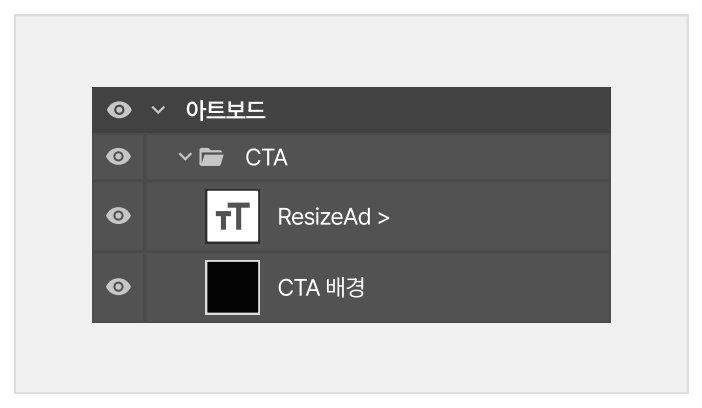
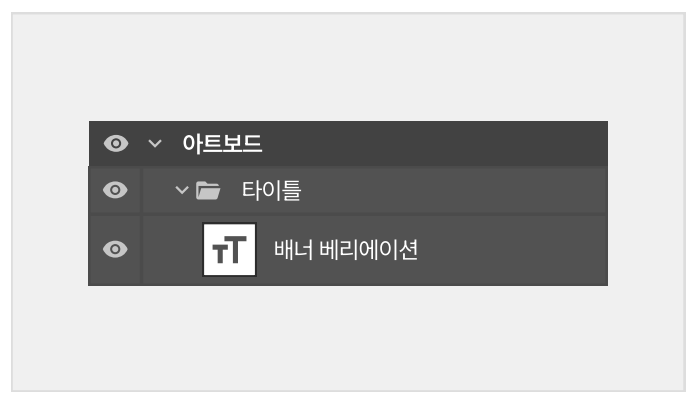

# 텍스트 / CTA 구성

#### **✅ DO**

▶ 텍스트는 속성이 살아있는 '텍스트 레이어' 상태 그대로 구성하세요.



<figure><figcaption></figcaption></figure>



<figure><figcaption></figcaption></figure>



#### **❌ DON'T**

▶ 텍스트를 이미지화(Rasterize)하지 마세요. 재배치 및 자동 줄바꿈이 불가능해집니다.



<figure><figcaption></figcaption></figure>



<figure><figcaption></figcaption></figure>



#### **✅ DO**

▶ 글자를 온전하게 작성하고 줄바꿈을 위해 명확한 띄어쓰기를 지켜주세요.



<figure><figcaption></figcaption></figure>



<figure><figcaption></figcaption></figure>



#### **❌ DON'T**

▶ 글자를 파편화(자음/모음 분리)하거나 레이어를 쪼개서 작성하지 마세요.



<figure><figcaption></figcaption></figure>



<figure><figcaption></figcaption></figure>



#### **✅ DO**

▶ CTA 버튼의 배경 이미지와 텍스트 레이어는 반드시 분리해 주세요.



<figure><figcaption></figcaption></figure>



<figure><figcaption></figcaption></figure>



#### **❌ DON'T**

▶ 배경색과 동일한 폰트 색상을 사용하지 마세요. 리사이즈 과정에서 글자가 가려져 보이지 않을 수 있습니다.



<figure><figcaption></figcaption></figure>



<figure><figcaption></figcaption></figure>



#### **✅ DO**

▶ 상하 또는 좌우로 명확하게 나뉜 직선형 분할 배경을 사용하세요.



<figure><figcaption></figcaption></figure>








#### **❌ DON'T**

▶ 사선(Diagonal) 분할 배경은 사용하지 마세요. 리사이즈 시 기울기가 왜곡되거나 연결 부위가 어색해집니다.



<figure><figcaption></figcaption></figure>



<figure><figcaption></figcaption></figure>


