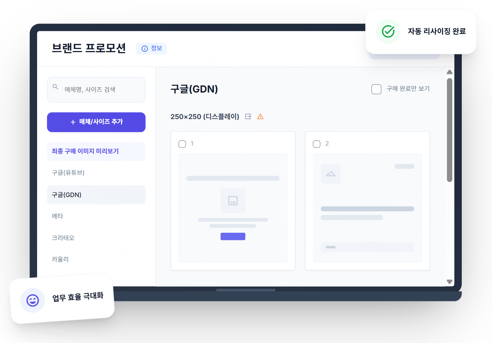
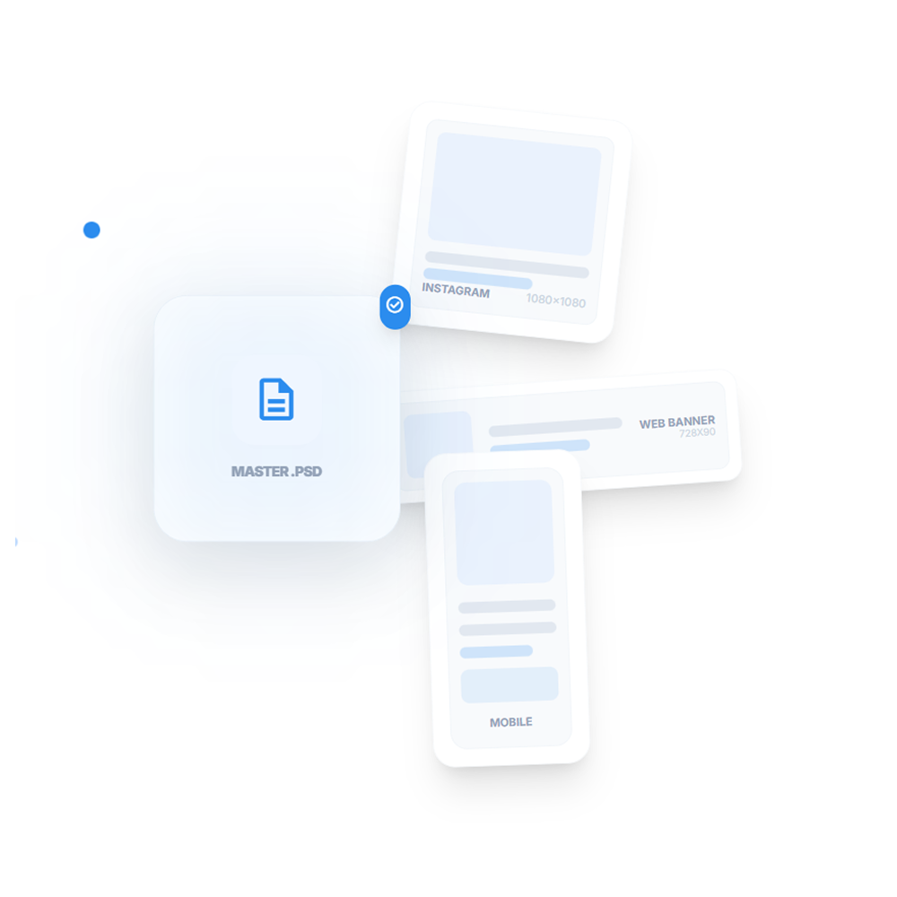
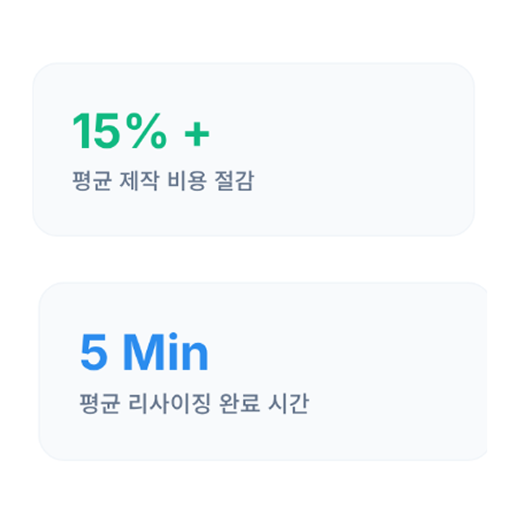
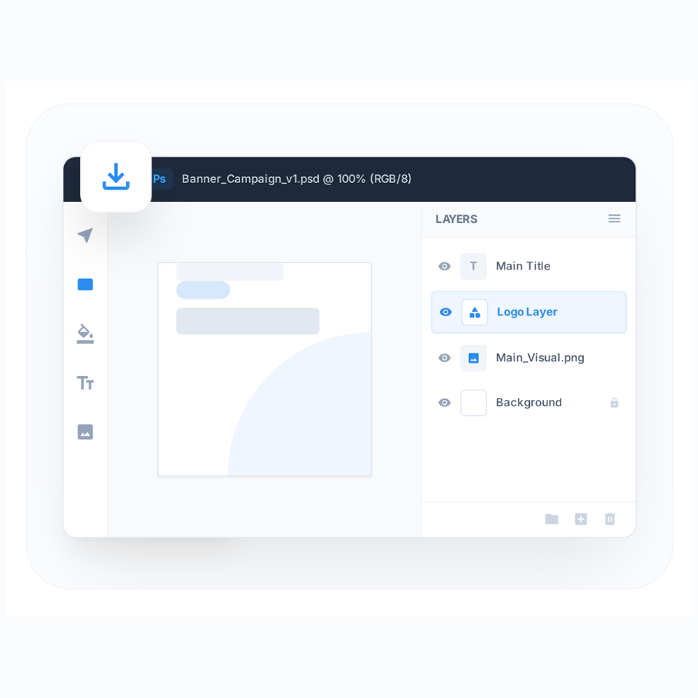

# 서비스 소개



## **배너 제작, 이제 AI에게 맡기세요.**

PSD 파일 하나만 올리면, 수십 개의 배너를 순식간에 제작 수 있습니다.\
복잡한 가이드 확인이나 단순 반복 작업은 리사이즈 애드가 대신할게요.

발급 받은 계정이 있으신가요?  <a href="https://resizead.kr/" class="button primary">로그인</a>



<figure><figcaption></figcaption></figure>



<figure><figcaption></figcaption></figure>

***



### **PSD 원본 하나로&#x20;**<mark style="color:$primary;">**모든 사이즈를**</mark>**&#x20;한 번에**

포토샵 파일(PSD) 하나만 올리면 끝이에요.\
AI가 원본 분석후 최적의 레이아웃을 찾아내요.

텍스트와 로고 위치까지 똑똑하게 재배치하니까,\
고품질 결과물을 바로 얻을 수 있어요.



<figure><figcaption></figcaption></figure>





<figure><figcaption></figcaption></figure>



### 비용은 <mark style="color:$success;">15% 이상</mark> 아끼고, 작업은 <mark style="color:$primary;">몇 분 만에</mark>

프리랜서나 외주 제작 대비 최소 15% 이상 저렴한 가격으로\
비용 부담을 낮춰요.

며칠씩 걸리던 수백 장의 배너 제작도 이제 단 몇 분이면 충분합니다.





### 수정까지 자유롭게, <mark style="color:$primary;">포토샵 파일</mark>도 드려요

JPG나 PNG는 물론, 포토샵 원본 파일(PSD)도\
추가 비용 없이 다운로드할 수 있어요.

AI가 만든 결과물에, 디자이너가 직접 디테일을 만질 수 있습니다.

<a href="https://app.gitbook.com/s/qTO6wXaq33F3OqsAyQA2/tool/psd" class="button primary" data-icon="hammer-brush">PSD 제작 팁</a>



<figure><figcaption></figcaption></figure>



***

<h2 align="center">지원 매체 리스트</h2>

네이버 GFA, 구글 GDN, 메타 등 국내 주요 디지털 매체의 다양한 DA 소재 규격을 지원합니다. 매체 규격은 지속적으로 업데이트되며, 구현되지 않은 사이즈는 직접 사이즈를 추가하여 생성할 수 있어요.



<figure><figcaption></figcaption></figure>



* **200여 개 사이즈 제작 가이드 적용**
* **규격 미달로 인한 반려 걱정 Zero**
* **매체 가이드 업데이트 반영**



<a href="https://app.gitbook.com/s/qTO6wXaq33F3OqsAyQA2/tool/supported-media" class="button primary" data-icon="book-open">지원 매체/사이즈 상세 보기</a>

***

<h2 align="center"><strong>문의하기</strong></h2>

📞전화 02-3475-4370 (평일 09:00~18:00 / 유료)     📧이메일: resizead@incross.com

