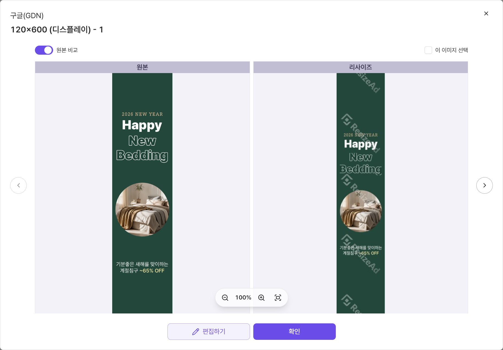
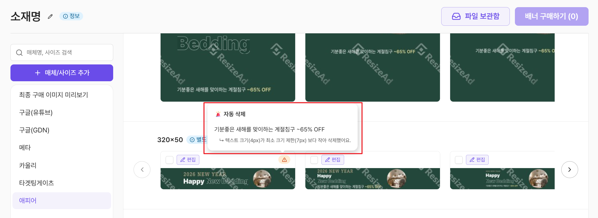
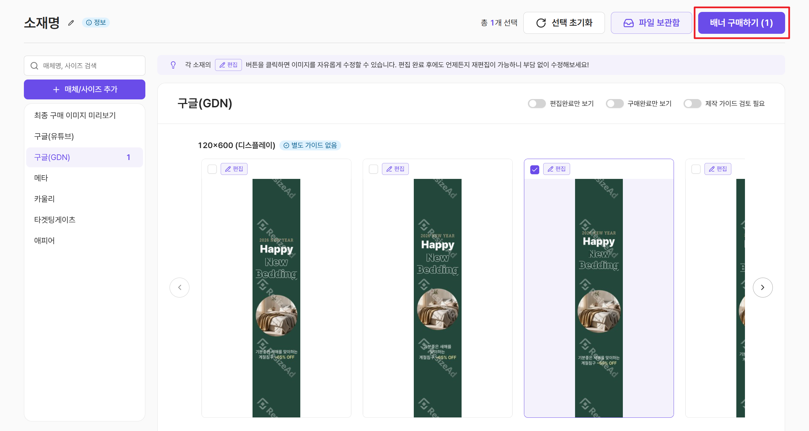
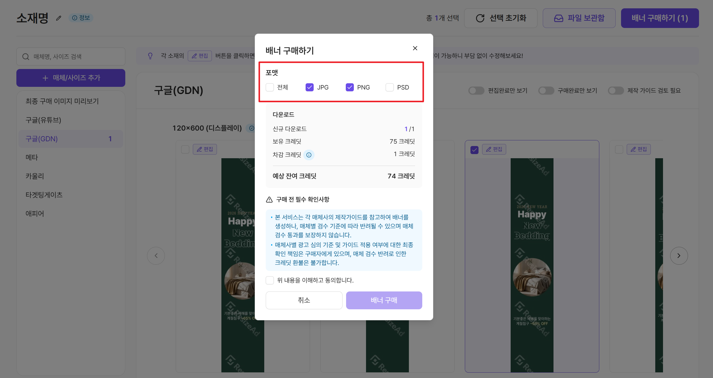

# 배너 구매하기

AI가 만든 배너 중 가장 마음에 드는 디자인을 골라보세요.\
구매 전, 미리보기와 최종 이미지의 차이점을 알면 더 똑똑하게 구매할 수 있습니다.

### **1️⃣ 제작된 배너 확인하기**

분석이 완료되면 매체별, 사이즈별로 베리에이션된 여러 배너 시안이 나타납니다.



<figure><figcaption></figcaption></figure>

> 사이즈 하나당 다양한 베리에이션이 제공되니, 가장 마음에 드는 배치를 꼼꼼히 확인하고 선택하세요.



<figure><figcaption></figcaption></figure>

> 이미지를 클릭하면 원본과 리사이즈된 이미지를 한눈에 비교할 수 있어요.




***

### **2️⃣ \[필독] 미리보기와 최종 구매 이미지는 달라요!**

미리보기 화면에서 그림자나 블러 같은 효과가 안 보여서 당황하셨나요? 안심하세요!

<figure><figcaption></figcaption></figure>

<table><thead><tr><th width="134">구분</th><th>사이즈 미리보기 이미지 (구매 전)</th><th>최종 구매 이미지 (구매 후)</th></tr></thead><tbody><tr><td><strong>특징</strong></td><td>구매 결정 참고용으로 <strong>AI가 그린 이미지</strong></td><td>포토샵 렌더링을 거친 <strong>최종 결과물</strong></td></tr><tr><td><strong>품질</strong></td><td>일부 특수효과가 반영되지 않을 수 있음</td><td><strong>포토샵의 모든 효과</strong>가 완벽히 적용됨</td></tr></tbody></table>

> **💡 구매 팁**\
> 미리보기에서 효과가 깨져 보여도, **최종 구매 이미지 미리보기**에서 문제가 없다면\
> 안심하고 구매를 진행하셔도 됩니다. 구매 후에는 포토샵 기반의 고품질 이미지가 제공됩니다.

***

### **3️⃣** 매체 가이드 확인하기

복잡한 매체별 광고 가이드라인을 이제 직접 꺼내볼 필요 없이 화면에서 바로 확인할 수 있습니다.

<figure><figcaption></figcaption></figure>

> **\[가이드 상세]** 버튼에 마우스를 올리면 해당 매체/사이즈에 적용된 제작 가이드라인을 바로 볼 수 있어요.

<figure><figcaption></figcaption></figure>

> 리사이즈 과정에서 텍스트가 최소 크기 제한(7px)보다 작은요소는 AI가 자동 삭제할 수 있어요.


아이콘에 마우스를 올리면 어떤 요소가 삭제되었는지 상세한 내용을 확인할 수 있으니 꼭 체크해 주세요!


***

### ✅ 매체 가이드 반영 결과 이해하기

배너가 매체 가이드를 얼마나 잘 따랐는지 **3가지 결과**로 안내드려요.

**🟢 제작 가이드 반영 완료**

> AI가 해당 매체/사이즈의 제작 가이드를 모두 반영했어요.\
> 안심하고 사용하셔도 좋아요.

<figure><figcaption></figcaption></figure>

**🟡 제작 가이드 검토 필요**

> AI가 판단하기 어렵거나 주관적인 가이드 항목이 있어 **사용자 확인이 필요**합니다.\
> 가이드가 준수 되었는지 꼭 확인해 주세요.

<figure><figcaption></figcaption></figure>


편집 기능으로 일부 항목을 직접 수정하거나, **PSD 파일**을 다운로드받아 직접 보정할 수 있습니다.


**⚪️ 별도 가이드 없음**

> 해당 사이즈는 매체에서 별도의 상세 제작 가이드라인을 제공하지 않아요.\
> AI가 최적의 배치로 자동 생성합니다.

<figure><figcaption></figcaption></figure>

### 4️⃣ **이미지 선택 및 구매하기**

구매하고 싶은 배너들을 모두 선택한 뒤, 우측 상단의 **\[배너 구매하기]** 버튼을 클릭하세요.

<figure><figcaption></figcaption></figure>

▶ 필요한 용도에 맞춰 세 가지 포맷 중 하나를 선택 후 \[배너 구매]를 클릭하세요.

<figure><figcaption></figcaption></figure>

* **JPG / PNG**: 별도의 작업 없이 광고 매체에 즉시 게재할 수 있는 이미지 파일입니다.
* **PSD**: AI가 배치한 레이어가 그대로 살아있는 포토샵 원본 파일입니다. 디테일한 수정이 필요할 때 선택하세요.

***

### ➡️ Next Steps

구매가 완료되었다면 이제 파일을 내 컴퓨터로 저장할 차례입니다.\
다음 가이드인 [\[완성된 파일 다운로드\]](download-files.md)에서 방법을 확인해 보세요!
