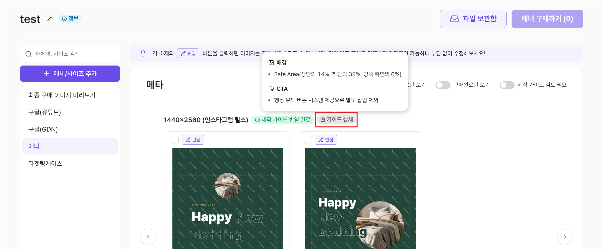
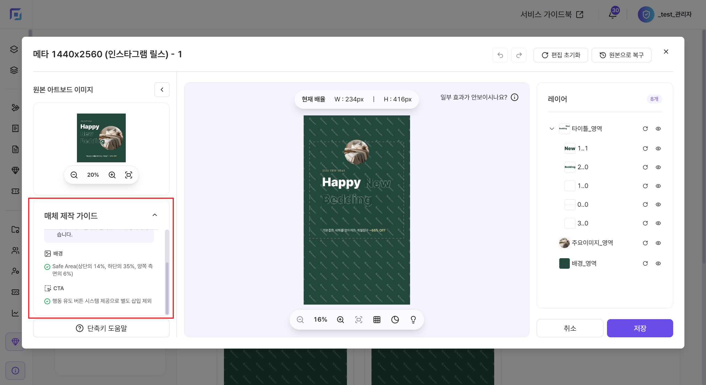

# 적용된 매체 가이드는 어디서 확인하나요?

배너 시안 옆의 **\[가이드 상세]** 아이콘에 마우스를 올려 보세요.\
해당 매체/사이즈의 상세 제작 가이드를 확인할 수 있습니다.

<figure><figcaption></figcaption></figure>

편집 화면에서도 **\[매체 제작 가이드]** 를 확인할 수 있어요.\
수정 시 가이드를 참고하여 이미지를 편집해 보세요.

<figure><figcaption></figcaption></figure>


편집 화면의 가이드 체크 결과는 실시간으로 반영되지 않습니다.

